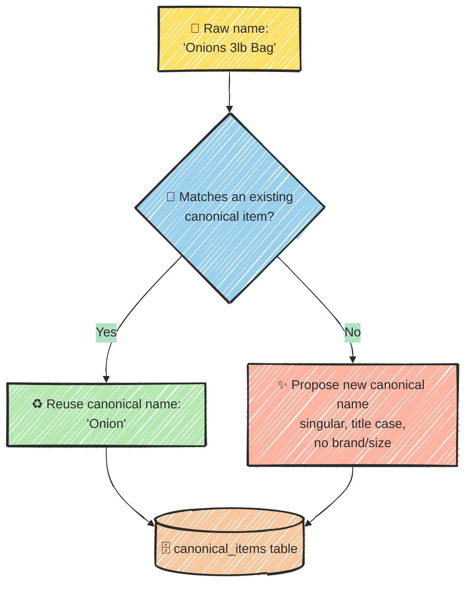

# I taught my homelab to read grocery receipts

I am the type of person who does not remember what things cost at the store.
I walk out with a full cart and, five minutes later, could not tell you if
the eggs were $4 or $8. This is a problem, because my wife will ask "how
much was it?" about literally anything, and "I don't know, I didn't look"
is not an answer that improves my standing in the household.

So I set up [paperless-ngx](https://docs.paperless-ngx.com/) originally just
to have an answer ready. It eats PDFs and photos, OCRs them, and files them
away, so every receipt gets scanned and the number exists somewhere, even if
I can't remember it. Every receipt filed away is secretly a tiny structured
dataset about my life: what I buy, how much of it, and whether onions have
gotten stupidly expensive again. The only thing standing between "crumpled
paper filed in paperless-ngx" and "actual insight" was... doing something
about it. So, homelab experiment time.

It turns out paperless-ngx is already about 80% of a receipt pipeline, built
and running. So instead of standing up a whole new ingestion system, I
bolted a small side-service onto the one I already had, and let it do the
one thing that's actually specific to groceries: turning receipt gibberish
into a real database, and a dashboard I named **Grocery Insights**.

This is the story of that pipeline, and yes, there are diagrams, because I
will take any excuse to draw boxes and arrows.

## Step 1: let paperless-ngx do what it already does

paperless-ngx was already quietly handling:

- Watching a "consume" folder and ingesting anything dropped into it
- OCR'ing every document automatically
- Tagging documents via configurable workflows
- Running [paperless-gpt](https://github.com/icereed/paperless-gpt) alongside
  it for LLM-assisted OCR and auto-classification

So my "new service" didn't need a file watcher, an OCR integration, or a
tagging UI. It just needed to ask paperless-ngx, politely and repeatedly,
"got anything tagged `receipts` + `Grocery` for me yet?"

Here's the whole flow, receipt to dashboard:

```mermaid
---
config:
  look: handDrawn
  theme: base
  themeVariables:
    primaryColor: '#FFE066'
    primaryBorderColor: '#2b2b2b'
    primaryTextColor: '#2b2b2b'
    lineColor: '#2b2b2b'
---
flowchart LR
    A["📸 Receipt photo"]:::input --> B["🗂️ paperless-ngx<br/>consume folder"]:::ingest
    B --> C["🔎 OCR'd by<br/>paperless-ngx / paperless-gpt"]:::ingest
    C --> D["🏷️ Tagged<br/>'receipts' + 'Grocery'"]:::tag
    D --> E["🔁 grocery-tracker polls<br/>for matching tags"]:::process
    E --> F["🤖 GPT-4o extracts<br/>structured JSON"]:::ai
    F --> G["🧹 gpt-4o-mini normalizes<br/>item names"]:::ai
    G --> H[("🐘 Postgres")]:::storage
    H --> I["✅ Tag flips to<br/>'receipt-processed'"]:::tag
    H --> J["📊 Grocery Insights<br/>dashboard"]:::output

    classDef input fill:#FFE066,stroke:#2b2b2b,stroke-width:2px,color:#2b2b2b
    classDef ingest fill:#9AD0EC,stroke:#2b2b2b,stroke-width:2px,color:#2b2b2b
    classDef tag fill:#FFB4A2,stroke:#2b2b2b,stroke-width:2px,color:#2b2b2b
    classDef process fill:#C3B1E1,stroke:#2b2b2b,stroke-width:2px,color:#2b2b2b
    classDef ai fill:#B5E8B0,stroke:#2b2b2b,stroke-width:2px,color:#2b2b2b
    classDef storage fill:#F6C89F,stroke:#2b2b2b,stroke-width:2px,color:#2b2b2b
    classDef output fill:#F49AC2,stroke:#2b2b2b,stroke-width:2px,color:#2b2b2b
```



*(Publishing somewhere that doesn't render Mermaid, like Medium? Use the static export instead: [`blog/images/receipt-pipeline-flow.png`](images/receipt-pipeline-flow.png))*

Notice what's *not* in that diagram: a second OCR step. The text was already
extracted once, upstream, for a completely different reason (searchable
document archive). grocery-tracker just reuses it. No images ever get
re-sent to an LLM, so every receipt costs one small text completion, not an
expensive vision call.

## Step 2: let GPT-4o deal with the receipt-formatting chaos

Every store's receipt is OCR soup in its own special way: pipe-delimited
item tables, tax code letters hanging off the end of lines, "Regular Price"
and "You Saved" lines that quietly apply to whatever's printed above them.
Writing a parser for this the traditional way would mean writing (and
babysitting) one regex monster per store. Instead, one prompt to GPT-4o asks
for a fixed JSON shape and handles discount fold-in and tax-code stripping
as part of the same call:

```json
{
  "store": "string",
  "date": "YYYY-MM-DD",
  "total": 42.17,
  "items": [
    {"name": "Onion", "category": "produce", "quantity": 3, "unit": "lb",
     "unit_price": 0.99, "total_price": 2.97}
  ]
}
```

Categories are a fixed, deliberately short list (produce, dairy, meat,
seafood, bakery, frozen, pantry, beverages, snacks, household,
personal_care, fee, other), so monthly spend charts stay meaningful instead
of fragmenting into fifty one-off buckets. Bottle deposits and bag fees get
their own `fee` category instead of quietly inflating the price of whatever
they're printed next to.

## Step 3: the actually hard part of making "Onion" mean "Onion"

Extraction alone isn't enough, because receipts never agree on what to call
anything. "Yellow Onions." "Onions 3lb Bag." "Red Onion." If those all land
as separate items, price history is useless. It just looks like three
different products I bought once each, instead of one product I buy every
week.

So before anything gets saved, every newly-extracted raw name gets checked
against the running list of canonical items and either matched to one or
added as new, via a second, cheaper LLM call (`gpt-4o-mini`). The fun part
was tuning the prompt to be conservative in the *right* direction: merge
cosmetic variation, but never merge genuinely different products just
because the words rhyme. "Green Onion" (a scallion) is not "Onion." "Sweet
Potato" is not "Potato." A raw line like "BEER CRV" is a bottle deposit.
Never, ever "Beer."



*(Static export for non-Mermaid platforms: [`blog/images/normalization-flow.png`](images/normalization-flow.png))*

The raw wording is still kept per line item, so the dashboard's receipt
detail view shows exactly what the receipt actually said. But price history,
store comparison, and search all key off the canonical name, so every
variant quietly merges. If the LLM ever gets a merge wrong, it's a
five-second fix directly in the `canonical_items` table. No redeploy
required. And if the normalization call itself fails, nothing blocks: the
item just falls back to its raw name, title-cased, and life goes on.

## The payoff: Grocery Insights

All of this (the polling, the extraction, the normalization gymnastics) is
in service of three questions I actually wanted answered. Here it is in
action, on my actual grocery data:


It answers:

- **What am I spending, and on what?** Monthly category-spend breakdown.
- **Is a specific item quietly getting more expensive?** Per-item price
  history over time.
- **Am I getting ripped off at one store versus another?** Cross-store price
  comparison for the same item.

The best part: I don't type anything into this system. It's a side effect of
grocery shopping the way I was already doing it, with paperless-ngx quietly
doing the ingestion work it was already doing.

## Homelab lessons (a.k.a. things that only broke once it was real)

A few things only showed up once this was running against actual receipts,
not test data:

- **A typo'd tag is indistinguishable from "no receipts yet."** The poll
  loop only logged when it found matching documents, so a misspelled tag in
  `RECEIPT_TRIGGER_TAGS` produced pure, misleading silence. Fix: log a
  warning the moment a configured trigger tag doesn't actually exist in
  paperless-ngx.
- **`requests`' default error messages lie by omission.** An OpenAI 400 on
  the normalization call logged as a useless
  `400 Client Error: Bad Request for url: ...`. No hint of *why*. Logging
  the actual response body turned it into an instantly diagnosable
  `"invalid model ID"`.
- **Naming things consistently is the hard 20%.** The normalization prompt
  needed several rounds of very specific examples (ripe banana vs. green
  banana, almond milk vs. milk, a biscuit that is not secretly a brioche)
  before it stopped over- or under-merging. Turns out "just make this field
  consistent" is where all the actual difficulty in an otherwise simple
  pipeline hides.

Up next: turning this from "a container running on my machine" into its own
proper Portainer stack with git-based auto-deploy, decoupled from the
paperless-ngx stack it quietly depends on.
